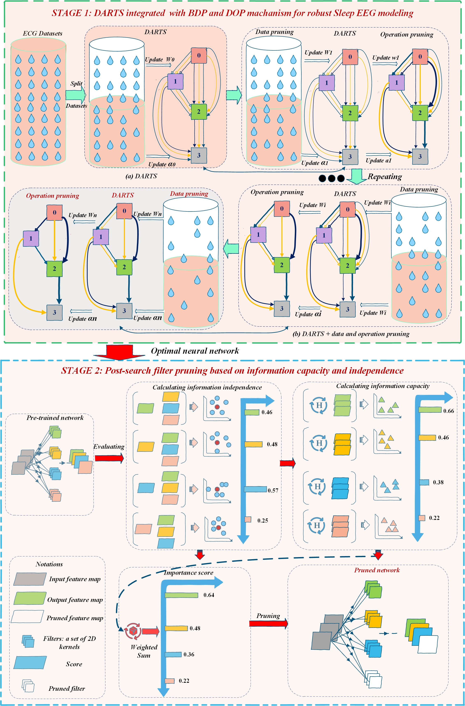

# DARTS_MultiLevel_Pruning
### EEG-Based Sleep Stage Classification via Differentiable Architecture Search and Multi-Level Pruning
#### *by: Van-Duc Khuat, and Wansu Lim, Department of Electrical and Computer Engineering, Sungkyunkwan, University, Republic of Korea, Suwon. 

## Abstract

Accurate sleep staging from electroencephalogram (EEG) signals is essential for sleep science, neurological diagnosis, and real-time health monitoring. Despite recent advances in deep learning, existing approaches face persistent challenges in deployment due to the high intersubject variability of EEG signals and the computational demands of state-of-the-art (SOTA) models, particularly in embedded and clinical settings. In this work, a unified two-stage framework is proposed that jointly optimizes neural architecture design and model compression through the integration of differentiable architecture search (DARTS) and multi-level pruning strategies. In Stage~1, DARTS is employed to discover compact yet expressive architectures under the joint influence of a bidirectional data pruning (BDP) mechanism, which removes noisy, imbalanced, and ambiguous samples, and a differentiable operation pruning (DOP) mechanism, which dynamically suppresses low-utility operations via temperature-controlled annealing. In Stage~2, the architecture obtained from Stage~1 is further refined by pruning the post-search filter based on information capacity and independence, reducing the number of convolutional filters by 50\% while preserving the accuracy of the classification. Experimental results on Sleep-EDF-20 and Sleep-EDF-78 demonstrate that the proposed method delivers robust and competitive performance across both stages, while significantly reducing model complexity, consistently outperforming or matching SOTA baselines. The models demonstrate strong generalization through 5-fold cross-validation and enable real-time inference on resource-constrained hardware, making the approach particularly well-suited for deployment in wearable devices, home-based sleep monitoring systems, and large-scale clinical screening. The proposed methodology also offers a generalizable blueprint for resource-efficient neural architecture design in biosignal-driven applications, with future extensions toward larger and more diverse datasets, transfer learning across subject populations, and optimization for mobile and embedded platforms.


We used three public datasets in this study:
- [Sleep-EDF-20](https://gist.github.com/emadeldeen24/a22691e36759934e53984289a94cb09b)
- [Sleep-EDF-78](https://physionet.org/content/sleep-edfx/1.0.0/)

After downloading the datasets, you can prepare them as follows:
```
cd prepare_datasets
python prepare_physionet.py --data_dir /path/to/PSG/files --output_dir edf_20_npz --select_ch "EEG Fpz-Cz"
```

## Training DARTS_MultiLevel_Pruning 
For runing code by main_dart.bdp_20.ipynb


